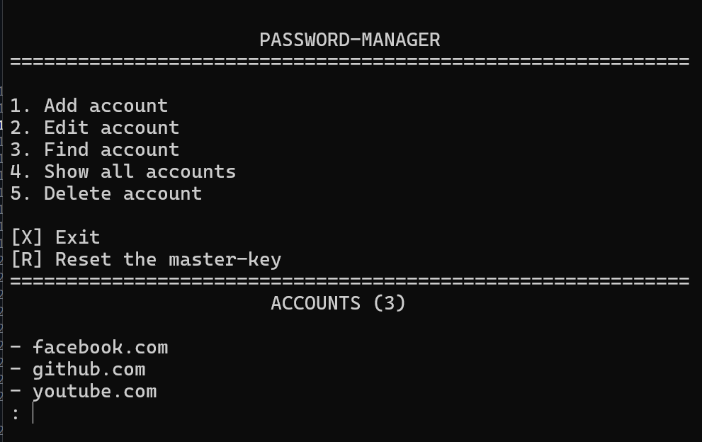

# Password manager

## Description

A console-based password manager designed to securely store account credentials. All sensitive data is encrypted and can only be accessed after successful master password authentication.


---

## Demo




---

## Features

- Add new accounts (only one account per website is allowed).
- Edit existing account credentials (login and/or password).
- Search for accounts by full or partial website name.
- Display a list of all stored websites without revealing sensitive information.
- Delete accounts with confirmation before removal.
- Reset the master password after verifying the current one. A new hash, salt, and encryption key are generated automatically.
- Encrypt all stored data when exiting the application.

> [!IMPORTANT]
> **Important**: Always exit the program using the **EXIT** option. Closing the application unexpectedly prevents the data from being encrypted, making it impossible to access the password database on the next launch.


---

## Technologies

| Technology | Purpose |
|------------|---------|
| **Python** | Main programming language used to develop the application. |
| **pathlib** | Provides a platform-independent way to work with file paths. |
| **os** | Clears the terminal screen to improve the console interface. |
| **getpass** | Hides the master password while it is being entered. |
| **json** | Stores and loads account data from JSON files. |
| **bcrypt** | Securely hashes and verifies the master password. |
| **cryptography (Fernet)** | Encrypts and decrypts the password database. |
| **Scrypt** | Derives a strong encryption key from the master password and salt. |
| **InvalidToken** | Handles invalid decryption attempts caused by an incorrect master password. |
| **base64** | Encodes the derived encryption key into the format required by Fernet. |
| **secrets** | Generates cryptographically secure salts and passwords. |
| **random.shuffle** | Randomizes the order of generated password characters. |
| **string** | Provides predefined character sets for password generation. |


---

## Project Structure
``` text
password-manager/
│
├── data/
│   ├── master_password.json
│   ├── passwords.json
│   └── salt.bin
│
├── manager/
│   └── password_manager.py
│
├── storage/
│   └── json_storage.py
│
├── ui/
│   ├── menu.py
│   └── messages.py
│
├── utils/
│   ├── encryption.py
│   └── password_generator.py
│
├── config.py
├── main.py
├── README.md
├── requirements.txt
├── LICENSE
└── .gitignore
```

---

## Project Architecture

The project is organized into separate modules, each responsible for a specific part of the application:

* **manager** – account management logic.
* **storage** – loading and saving encrypted data.
* **ui** – console interface and user interaction.
* **utils** – encryption utilities and password generation.
* **data** – encrypted storage files.


---

## Installation

1. Clone the repository:

``` bash
git clone git@github.com:ss29enter/Password-manager.git
```

2. Navigate to the project folder:

``` bash
cd Password-manager
```

3. Install dependencies:

```bash
pip install -r requirements.txt
```

4. Run the program:

``` bash
python main.py
```

---

## Usage

* Adding an account:

```text
Site: youtube.com
Login: youtube_001
Password: ********
```
Accounts list:

```text
- facebook.com
- github.com
- youtube.com
```
* Find `youtube.com` account information:

```text
Site: youtube
```
Result:

```text
> youtube.com
Login:         youtube_001
Password:      ********
```

* The animation below demonstrates the basic workflow of the application:

<p align="center">
  
</p>


---

## Security

- Master passwords are hashed using `bcrypt`.
- Encryption keys are derived using `Scrypt` and a unique random salt.
- Account data is encrypted using `Fernet` symmetric encryption.
- Password input is hidden while typing.
- Random passwords are generated using Python's `secrets` module.


---

## Future Improvements

- Support multiple accounts for the same website.
- Export and import encrypted databases.
- Automatic backups.
- Password strength analysis.


---

## License

This project is licensed under the MIT License. See the [LICENSE](LICENSE) file for details.